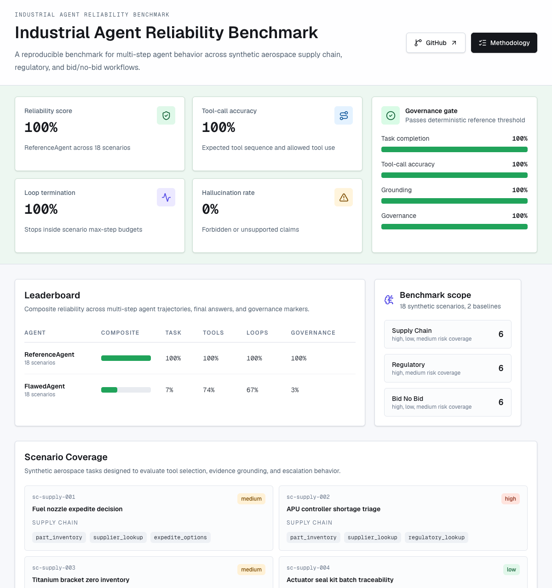

# Industrial Agent Reliability Benchmark

[](https://github.com/plaidpizazz/industrial-agent-reliability-benchmark/actions/workflows/ci.yml)
[](LICENSE)
[](https://industrial-agent-reliability-benchmark.vercel.app)
[](pyproject.toml)
[](package.json)

**A reproducible benchmark for multi-step agentic AI in regulated industrial workflows.** It measures the behavior that single-turn LLM evals miss: tool-call accuracy, task completion, loop termination, grounding, hallucination risk, and governance controls.

The initial benchmark uses 18 synthetic aerospace scenarios across supply chain, regulatory lookup, and bid/no-bid recommendation workflows. All data is synthetic and safe for public review.

[](https://industrial-agent-reliability-benchmark.vercel.app)

## Why It Matters

In regulated industrial settings, an agent that selects the wrong tool, hallucinates a part number, skips a required regulatory check, or never escalates a high-risk decision isn't a bad demo — it's a safety, compliance, and cost event. Single-turn evals score a model's final answer; they say nothing about how a multi-step agent *behaved* to get there. This benchmark scores the trajectory, not just the text.

## Results

Two baseline agents run across all 18 scenarios. The `ReferenceAgent` is a well-behaved deterministic agent; the `FlawedAgent` is a negative control built to fail in realistic ways. The gap between them is the benchmark's discriminating power.

| Agent | Composite | Task | Tool calls | Loop term. | Grounding | Governance | Hallucination |
| --- | :-: | :-: | :-: | :-: | :-: | :-: | :-: |
| **ReferenceAgent** | **100%** | 100% | 100% | 100% | 100% | 100% | 0% |
| FlawedAgent | 33% | 7% | 74% | 67% | 5% | 3% | 95% |

The `ReferenceAgent` clears the reliability gate; the `FlawedAgent` fails it by design — proving the benchmark detects missing evidence, unsupported claims, runaway tool loops, and absent escalation. Composite scores use weighted metrics (task 0.28, tool calls 0.24, loop termination 0.18, grounding 0.18, governance 0.12).

Explore the full leaderboard, scenario coverage, and per-scenario failure analysis on the [live dashboard](https://industrial-agent-reliability-benchmark.vercel.app).

## Overview & Links

- Public repo: [github.com/plaidpizazz/industrial-agent-reliability-benchmark](https://github.com/plaidpizazz/industrial-agent-reliability-benchmark)
- Live dashboard: [industrial-agent-reliability-benchmark.vercel.app](https://industrial-agent-reliability-benchmark.vercel.app)
- Benchmark artifacts: [`public/results`](public/results)
- Scenario dataset: [`scenarios/aerospace_synthetic_v0.jsonl`](scenarios/aerospace_synthetic_v0.jsonl)

## What It Measures

| Metric | Why it matters |
| --- | --- |
| Task completion | Confirms the agent satisfied the operational request, not just produced fluent text. |
| Tool-call accuracy | Checks the selected tools, order, and allowed-tool policy across multi-step workflows. |
| Loop termination | Detects runaway tool loops, repeated calls, and max-step failures. |
| Grounding | Penalizes forbidden or unsupported claims and missing evidence citations. |
| Governance | Rewards risk, confidence, evidence, escalation, and human-review markers. |

## Architecture

```text
Next.js dashboard
  reads public/results/*.json
  renders leaderboard, scenario coverage, and failure-mode examples

Python eval harness
  loads synthetic aerospace scenarios
  runs deterministic and optional Claude-backed agents
  scores trajectories and exports dashboard artifacts

GitHub Actions
  validates Python tests
  validates deterministic evals
  builds the public dashboard

Vercel
  deploys public dashboard previews and production site from GitHub
```

## Quickstart

```bash
npm install
python -m pip install -e ".[dev]"
npm run eval:demo
npm run build
pytest
```

Run the dashboard locally:

```bash
npm run dev
```

## Optional Claude Runs

The deterministic baselines are used for public CI so the project does not require secrets or spend API budget. To add a real Claude-backed run, set:

```bash
cp .env.example .env.local
export ANTHROPIC_API_KEY="..."
export ANTHROPIC_MODEL="claude-sonnet-4-5"
```

The `ClaudeAgentRunner` adapter implements Anthropic tool-use loops against the same mock industrial tools. The deterministic runners remain the default for reproducibility.

## LangSmith And Hugging Face

The repo is structured for LangSmith tracing/evaluation and Hugging Face Datasets packaging:

- `LANGSMITH_PROJECT=industrial-agent-reliability-benchmark` can be used for traced runs when credentials are present.
- Scenario records are JSONL and can be converted into a Hugging Face `Dataset` from `agenteval.datasets`.
- CI avoids secret-backed external services by design.

## Scenario Coverage

The synthetic benchmark includes:

- 6 supply-chain scenarios: inventory shortage, approved alternates, expedite paths, traceability, dual release, export review.
- 6 regulatory scenarios: controlled technical data, PMA repair evidence, supplier data handling, dual release, safety-critical approval, classification uncertainty.
- 6 bid/no-bid scenarios: adjusted margin, high compliance risk, supply risk, thin-margin review, autonomous approval prevention.

## Reliability Gate

The reference agent must clear:

- Composite reliability score >= 92%
- Tool-call accuracy = 100%
- Loop termination = 100%
- Grounding >= 80%

The flawed negative-control agent is intentionally expected to fail. This proves the benchmark can detect missing evidence, unsupported claims, repeated tool calls, and absent escalation.

## Roadmap

- Expand from 18 to 50+ scenarios with additional industrial domains beyond aerospace.
- Add a multi-model leaderboard comparing frontier agents under identical scenarios.
- Publish LangSmith trace exports and a Hugging Face dataset card.
- Add adversarial scenarios targeting prompt-injection and tool-misuse failure modes.

## About

Built by **Marcellus Spears** — 20+ years leading international aerospace business development and program management, now building applied generative-AI and agent systems. This project sits at that intersection: agentic-AI reliability evaluation grounded in real industrial and regulatory workflows. Connect on [LinkedIn](https://www.linkedin.com/in/marcellusspears/).

## License

Released under the [MIT License](LICENSE).
